# MyNote
使用Qt编写的一款日程软件
## 程序架构

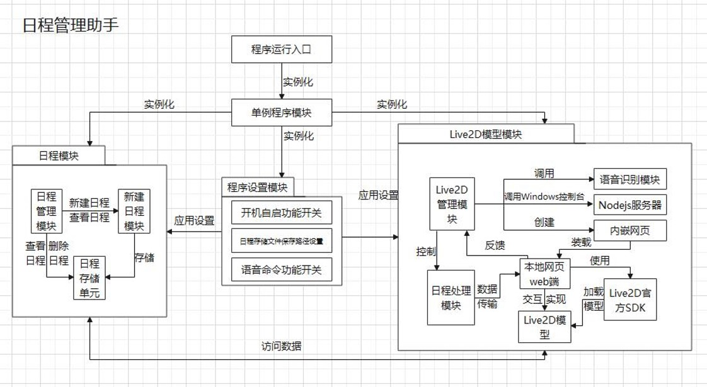

## 开发环境
- 操作系统：Windows 10
- 编译程序：MSVC 2019
- 编译语言：C++、Javascript、HTML5
- 外部软件/框架：Node.js、[CubismSDKForWeb-4-r.2](https://github.com/Live2D/CubismWebFramework)、[ARST_SpeechRecognition](https://github.com/nl8590687/ASRT_SpeechRecognition)、Qt5.15
- 开发工具：Qt Creator、Visual Studio 2019、Visual Studio Code

### 单例程序模块

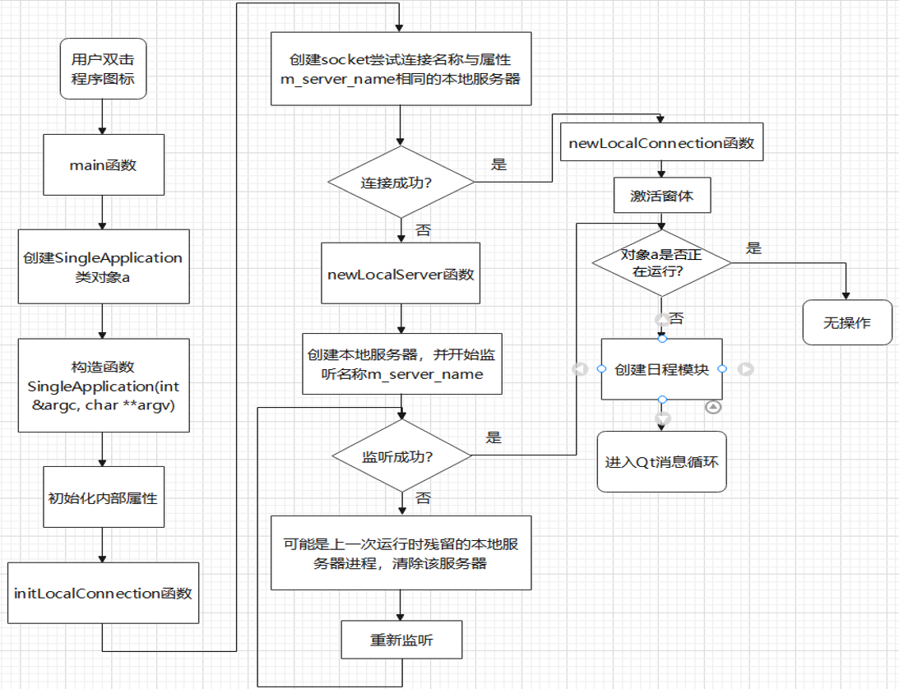

### 日程模块

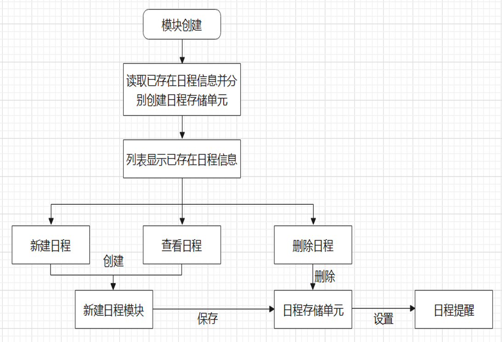

### 新建日程模块

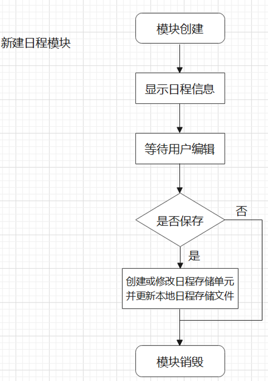

### Live2D 模型模块

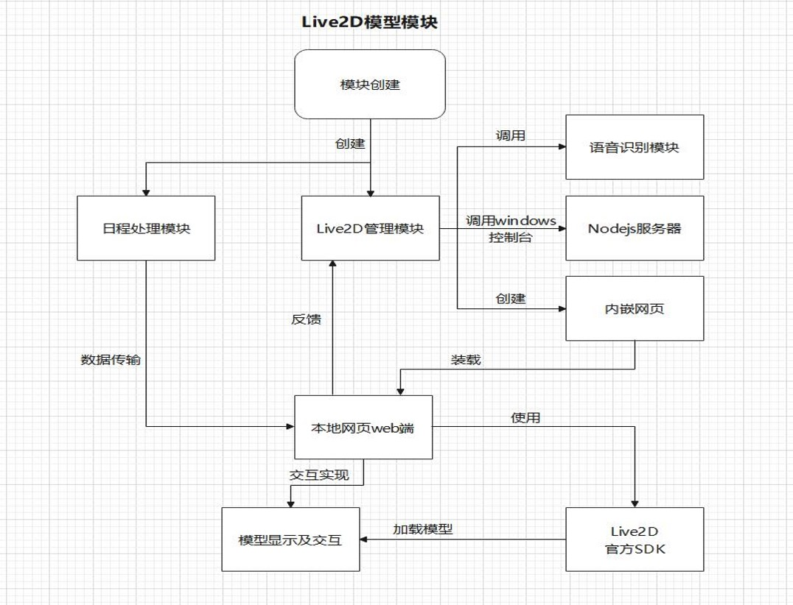

## 软件展示
### 主界面

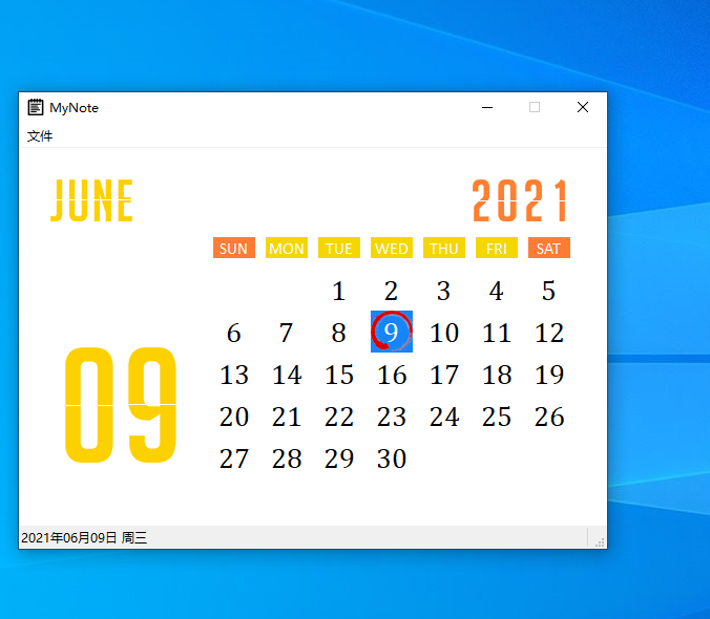

### Live2D 模型界面

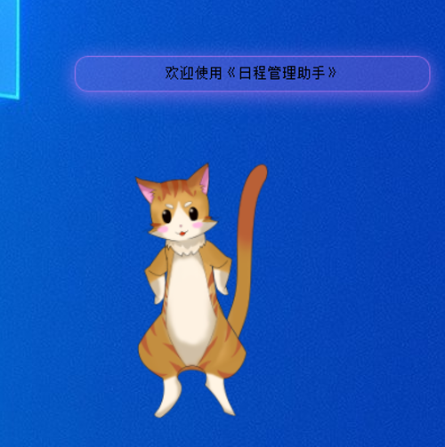

### 日程相关界面

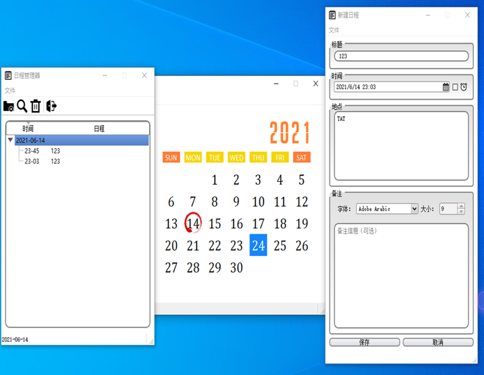

### 语音识别功能
语音识别功能需要在设置界面开启，如下图所示。

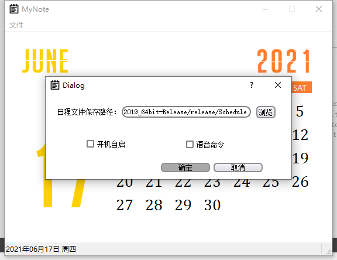

开启后，若存在麦克风设备以及设备正常，Live2D 模型界面将出现“开始录音”和“停止录音”按钮，以进行声音录制，如下图所示；

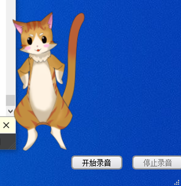

然后通过调用语音识别 API 识别该录音文件；若识别失败，将弹出窗口进行提示，如下图所示。

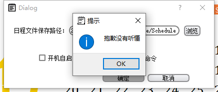

